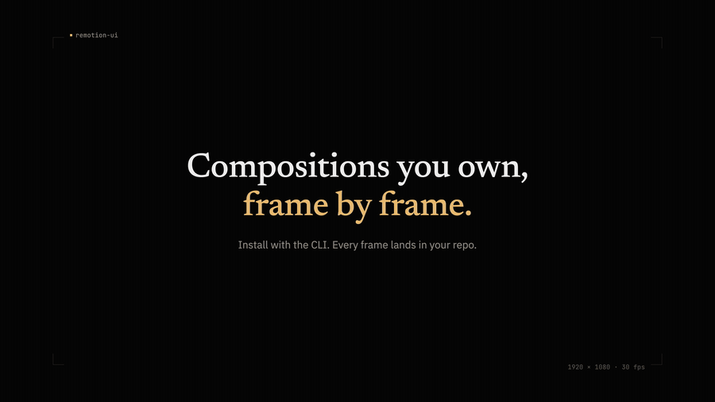

<div align="center">


# RemotionUI

**200 copy-paste components for [Remotion](https://www.remotion.dev). Source you own, frame by frame.**

<a href="https://remotionui.com"></a>
<a href="https://www.npmjs.com/package/remotion-ui"></a>
<a href="LICENSE"></a>



[Browse components](https://remotionui.com/docs/components/browse) · [Quick start](https://remotionui.com/docs/installation) · [CLI](https://remotionui.com/docs/cli) · [MCP server](https://remotionui.com/docs/mcp)

</div>

## Install

```bash
npx remotion-ui@latest init my-video
cd my-video
npx remotion-ui@latest add social-clip
```

Already have a Remotion project? `npx remotion-ui@latest init --existing`.

## Why

- **You own the source.** Components land in your repo as plain `.tsx`. No black-box npm package to fight — edit any frame, any easing, any color.
- **Composed, not just primitives.** Full compositions (social clips, data stories, creator reels) alongside the primitives they're built from.
- **Built for agents.** Every command speaks `--json`, plus an [agent index](https://remotionui.com/ai/components.json), [llms.txt](https://remotionui.com/llms.txt), an [MCP server](packages/remotion-ui-mcp/README.md), and an installable Claude Code skill.

## What's inside

200 components, grouped by how they behave on the timeline:

| Lane | Count | What it covers |
|------|------:|----------------|
| **Primitives** | 51 | Motion, text effects, backgrounds |
| **Scenes** | 53 | Composed layouts, cards, UI blocks |
| **Data & media** | 38 | Captions, audio, charts, live metrics |
| **Compositions** | 21 | Full video templates, ready to render |
| **Transitions** | 18 | `TransitionSeries` scene cuts |
| **Paths & shapes** | 11 | SVG draw-on, logos, cursors |
| **Maps & device** | 8 | Map scenes and device mockups |

[Browse the full catalog →](https://remotionui.com/docs/components/browse)

## CLI

```bash
npx remotion-ui@latest search -q caption   # find components
npx remotion-ui@latest add caption-scene   # install with dependencies
npx remotion-ui@latest diff caption-scene  # see your edits vs registry
npx remotion-ui@latest doctor              # diagnose config and aliases
```

Full reference: [remotionui.com/docs/cli](https://remotionui.com/docs/cli)

## Use it with your agent

```bash
npx remotion-ui@latest init --agent-skill   # install the Claude Code skill
```

Or point any MCP client at the [RemotionUI MCP server](packages/remotion-ui-mcp/README.md) to give it search-and-install over the registry.

## Guides

[Captions](https://remotionui.com/docs/guides/captions) · [Audio visualization](https://remotionui.com/docs/guides/audio-viz) · [Transitions](https://remotionui.com/docs/guides/transitions) · [Motion tokens](https://remotionui.com/docs/guides/motion-tokens) · [Maps](https://remotionui.com/docs/guides/maps) · [Authoring scenes](https://remotionui.com/docs/guides/authoring-scenes)

## Contributing

Component ideas, bug reports, and PRs are welcome — see [CONTRIBUTING.md](CONTRIBUTING.md) for the monorepo layout, dev setup, and how to author a registry component.

## License

MIT
