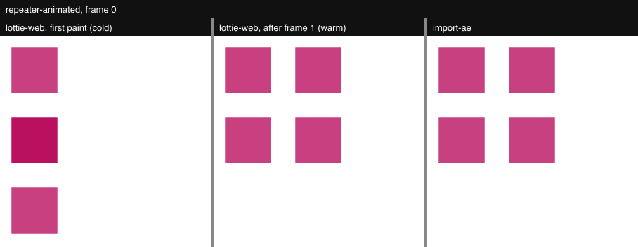
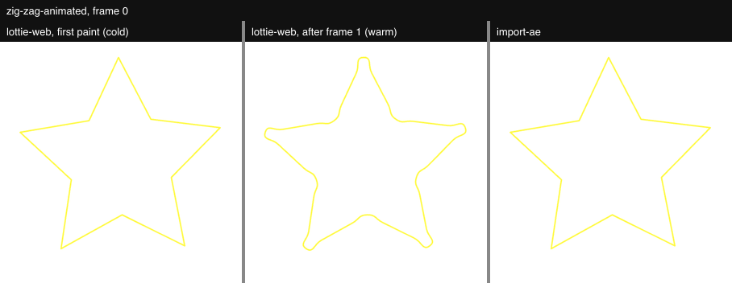

# import-ae fidelity bench

Every fixture in `fixtures/` is rendered twice at the same frames (first, a
keyframe, both quarters, middle, last): through `@remotion/lottie`
(lottie-web, SVG renderer) and through the TSX `remotion-ui import-ae` wrote
for it (`generated/`). Each pair is scored with PSNR, SSIM and the share of
pixels whose colour differs by more than 32/255 in any channel. PSNR alone can
average a misplaced shape away; the mismatch share cannot.

```bash
pnpm --filter remotion-ui build
cd apps/web
node showcase/import-ae-bench/make-animated.mjs      # derived fixtures
npx tsx showcase/import-ae-bench/generate.mts        # runs the real CLI
npx tsx showcase/import-ae-bench/compare.mts         # scores + sheets in out/
npx tsx showcase/import-ae-bench/audit.mts           # blank / static-frame guard
npx tsx showcase/import-ae-bench/evidence.mts        # evidence strips below
```

Fixture sources and licences: [`fixtures/SOURCES.md`](fixtures/SOURCES.md).

## Reference policy

One fixed reference for every fixture and frame: **`LottieWarm-*`**, lottie-web
after it has already drawn frame 1, so the scored frame is always a re-render.
A still render of frame 0 would otherwise capture lottie-web's very first paint
of the page, which is not reliable (bug 1 below).

No reference is ever swapped per fixture or per frame. Where the warm reference
is itself wrong, the frame is still scored against it and flagged
(`referenceBug` in `out/results.json`, a caption on the sheet). Frame 0 of every
fixture is also rendered cold, for the record only (`firstRender` in the
results).

## Known lottie-web bugs

### 1. Stacked repeaters: the first paint is incomplete (`repeater-animated`)

On a page's first paint, lottie-web draws a group with two repeaters before
the second repeater has built its copies: three squares in a column instead of
the 2×2 grid. Any later render of the same frame is correct.

| Frame 0 | PSNR | Mismatch |
|---|---|---|
| lottie-web cold vs lottie-web warm | 13.85 dB | 19.36% |
| import-ae vs lottie-web warm (scored) | 60.03 dB | 0% |
| import-ae vs lottie-web cold | 13.85 dB | 19.36% |



The scored reference (warm) is correct here, so this bug does not affect the
table.

### 2. Zig Zag at size 0 keeps a stale path (`zig-zag-animated`)

`ZigZagModifier.processShapes` only runs when the size is non-zero, and does
not reset the path when it is zero. The fixture's size animates from 0, so
frame 0 should show the plain star. That is what lottie-web's first paint
shows, but after lottie-web has drawn frame 1 its frame 0 keeps frame 1's
zig-zag. In playback, that is what a loop shows every time it returns to the
start.

| Frame 0 | PSNR | Mismatch |
|---|---|---|
| lottie-web cold vs lottie-web warm | 27.71 dB | 1.52% |
| import-ae vs lottie-web warm (scored) | 27.72 dB | 1.52% |
| import-ae vs lottie-web cold | 58.54 dB | 0.013% |



Here the scored reference is the wrong image, so the table carries the low
number with a footnote.

## Results

Warm reference, every sampled frame. Last run 2026-09-30.

| Fixture | Min PSNR (dB) | Mean SSIM | Max mismatch |
|---|---|---|---|
| android-wave | 52.46 | 0.9999 | 0.033% |
| bouncy-ball | 47.91 | 0.9998 | 0.053% |
| check-switch | 52.65 | 0.9999 | 0.02% |
| gradient | identical | 1 | 0% |
| gradient-fill-animated | identical | 1 | 0% |
| hamburger-arrow | 66.58 | 1 | 0.001% |
| lottie-logo-1 | 53.77 | 0.9999 | 0.01% |
| lottie-logo-2 | 43.94 | 0.9997 | 0.088% |
| offset-path | 59.68 | 1 | 0.01% |
| offset-path-animated | 52.53 | 1 | 0.045% |
| pucker-bloat | 59.90 | 1 | 0.009% |
| pucker-bloat-animated | 41.90 | 0.9998 | 0.093% |
| remapping | 65.92 | 1 | 0.002% |
| repeater | 56.41 | 0.9999 | 0.009% |
| repeater-animated | 55.79 | 1 | 0.008% |
| repeater-animated-single | 61.46 | 1 | 0% |
| shape-types | 44.19 | 0.9997 | 0.17% |
| split-dimensions | 56.37 | 1 | 0.01% |
| star-splosion | 52.12 | 1 | 0.029% |
| time-stretch-precomp | 81.48 | 1 | 0% |
| trim-path | 63.55 | 1 | 0.004% |
| trim-paths | 56.43 | 1 | 0.01% |
| trim-wrap-around | 48.61 | 0.9999 | 0.02% |
| zig-zag | 61.79 | 1 | 0.006% |
| zig-zag-animated | 27.72 ¹ | 0.9973 | 1.519% ¹ |
| zig-zag-ridges | 60.35 | 1 | 0.008% |

¹ Frame 0 only, where the reference itself is wrong: lottie-web bug 2 above.
Every other sampled frame of `zig-zag-animated` scores ≥ 58.76 dB.